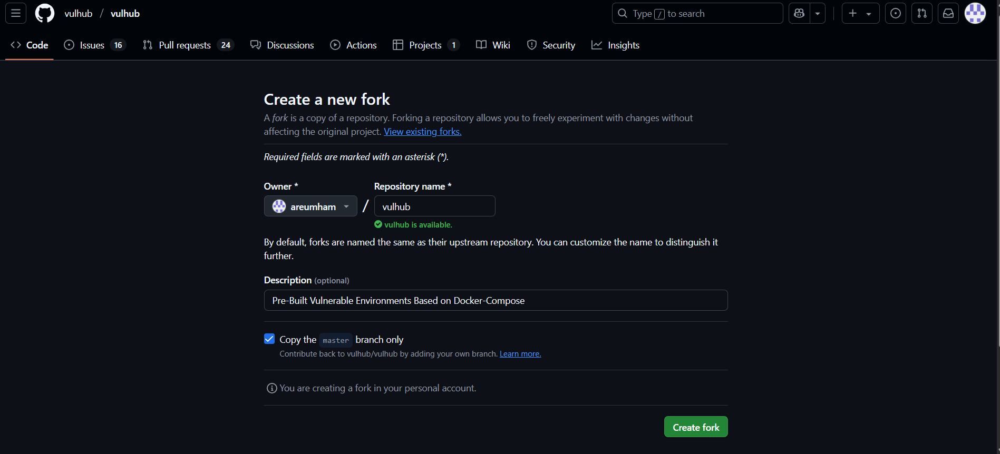
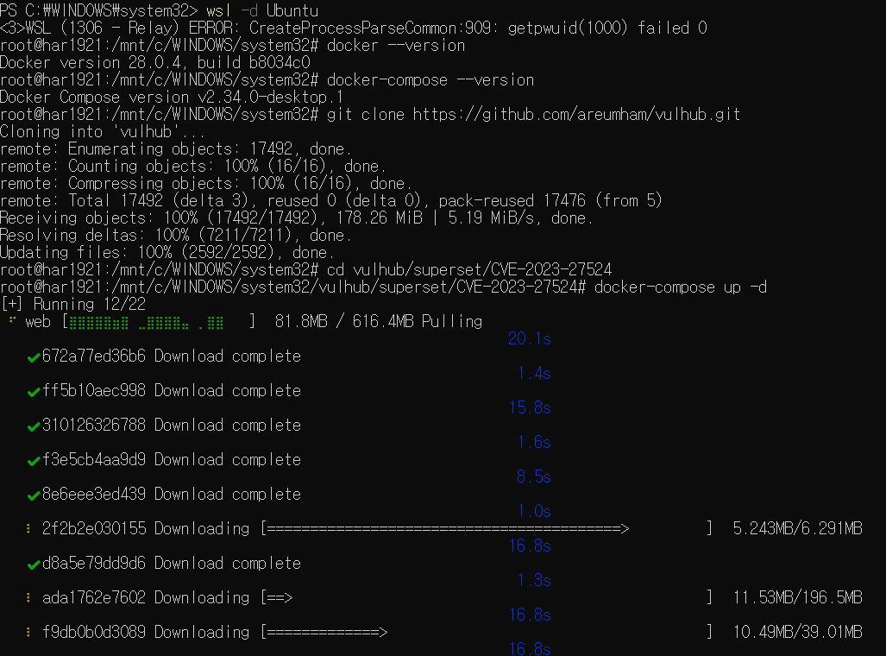
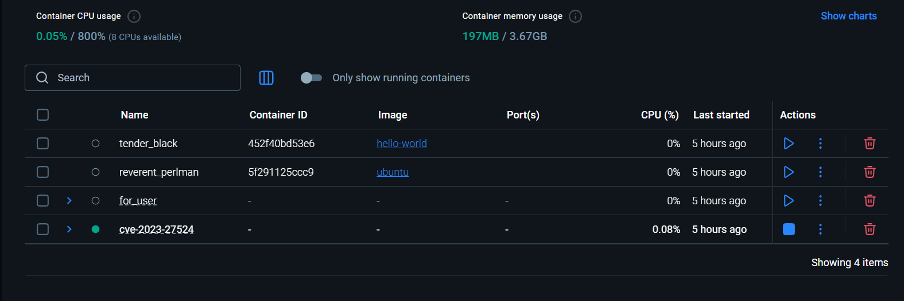
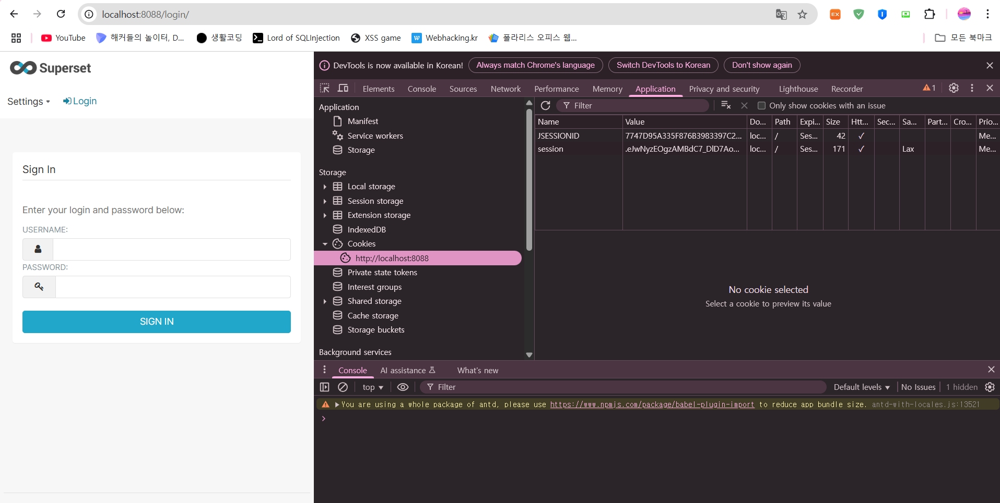
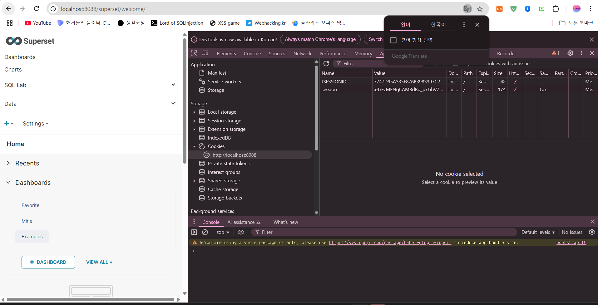

# CVE-2023-27524 취약점 분석 및 실습 보고서

1. 개요
2. 실습 환경 구성
3. 환경 설정
4. 취약점 개요 및 공격 흐름
5. 결론

개요

Apache Superset은 시각적이고 대화형으로 설계된 오픈 소스 데이터 탐색 및 시각화 플랫폼이다.
본 보고서에서 다루는 CVE-2023-27524는 superset에 하드코딩된 JWT 비밀 키(CVE-2023-27524)로 인해
발생하는 인증 우회 취약점이다.이 취약점은 superset이 기본 키를 변경하지 않은 채 운영될 경우, 공격
자가 유효한 세션 쿠기를 위조하여 관리자 권한을 탈취할 수 있는 문제이다. 이를 통해 대시보드 및 연결
된 데이터베이스에 무단 접근할 수 있으며, 심각한 경우 원격 코드 실행(RCE)로 이어질 수 있다. 또한, 해
당 취약점은 CVE-2023-37941과 결합될 경우 역직렬화 취약점을 통한 원격 코드 실행이 가능해지는 등,
공격의 위협이 증대된다.

🔗 출처:
https://nvd.nist.gov/vuln/detail/CVE-2023-27524

https://github.com/vulhub/vulhub/tree/master/superset/CVE-2023-27524

실습환경 구성

CVE 번호 : CVE-2023-27524
대상 애플리케이션 : Apache Superset
실습 목적 : CVE 환경을 Docker로 구성하고, 인증 우회 취약점 PoC를 실행하여 관리자 세션 탈취 과정을
검증한다.
도구 및 버전
OS : Ubuntu 20.04 (WSL2 사용)
Docker version : 28.0.4
docker-compose version : 2.34

 환경 설정

1) vulhub 링크 : https://github.com/vulhub
vulhub 레포지토리를 자신의 GitHub 계정으로 Fork한 후, 해당 레포지토리에서 작업을 진행하였다.

docker wsl과 연결 wsl과 연결해주고, 취약한 Apache Superset 이미지를 실행시켜준다. 

2) cd vulhub/superset/CVE-2023-27524 docker-compose up -d 를 실행해준다.

docker desktop과 잘 연결됨을 볼 수 있다.

3) 컨테이너 및 포트 확인 Docker Desktop 컨테이너가 정상 실행되었는지 확인하고, 브라우저로 접속한다.

브라우저에 접속하기 위해 포트번호를 확인하고 접속한다. 필자의 포트는 8088로 http://127.0.0.1:8080로 접속한다

접속이 완료됨을 보여준다. 
이것이 뜻하는 바는 세션 쿠키를 위조하여 Superset에 로그인하는 과정은, 해당 취약점이 인증 우회 가능하다는 것을 보여준다. 별도의 사용자 계정 없이도 접근이 가능하다는 점에서 위험성을 보인다.

4) CVE-2023-27524 PoC 실행 
이를 위해
Install dependencies

pip install -r requirements.txt
Forge an administrative session (whose user_id is 1) cookie
python CVE-2023-27524.py --url http://your-ip:8088 --id 1 --validate 실행해준다.

이 명령어를 실행해줬을 때, 에러가 나와 가상환경을 만들어 다시 실행해주었다.

실행한 결과 세션을 얻을 수 있었다.

이제 이결 활용하여 브라우저 로그인 쿠키를 바꿔 로그인을 시도해볼것이다. 먼저 브라우저에 접속하여 개발자 도구 -> application에 들어가준다. 밑에 주소를 클릭하면 session 값이 지정되어있음을 알 수 있다.

session값에 아까 얻은 세션값으로 대체해준다.

세션 값을 대체하고 새로고침을 해주면 로그인이 되었음을 확인할 수 있다.

5. 결론 
CVE-2023-27524는 기본 설정 그대로 운영 중인 Apache Superset 환경에서 인증 우회를 가능하게 하는 치명적인 취약점이이다. 실습을 통해 관리자 세션을 탈취하고 실제로 인증되지 않은 상태에서 시스템에 접근할 수 있음을 검증하였다.
해당 취약점을 방지하기 위해서는 Superset 설정 시 반드시 SECRET_KEY를 강력한 랜덤 값으로 변경해야하며, 외부에서 접근 가능한 환경에 대해서는 보안 구성(방화벽, 접근 제어 등)도 반드시 병행해야한다.

